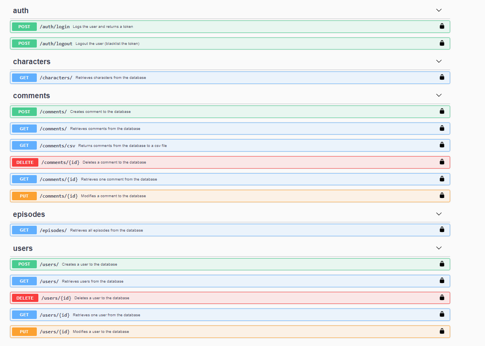

# JELLYSMACK test

## Installation

Use the package manager [pip](https://pip.pypa.io/en/stable/) to install foobar.

```bash
pip install -r requirements.txt
```

## Create database

Create a .env file based on .env.example file:

```bash
APP_SETTINGS=config.DevelopmentConfig
DATABASE_URL=sqlite:///app.db
```

For create the database, launch these commands:

```bash
python manager.py db init
python manager.py db migrate
python manager.py db upgrade
```

## Usage

### Import data

```bash
# With, in the same folder, the files rick_morty-characters_v1.json 
# and rick_morty-episodes_v1.json .
python data/import_data.py 

# With another files.
python data/import_data.py -c characters.json -e episodes.json
```

### Unit tests

```bash
python -m unittest discover tests
```

### Run API server

```bash
python app.py
```

Now you can access to http://127.0.0.1:5000/api/doc and see all possible calls.

